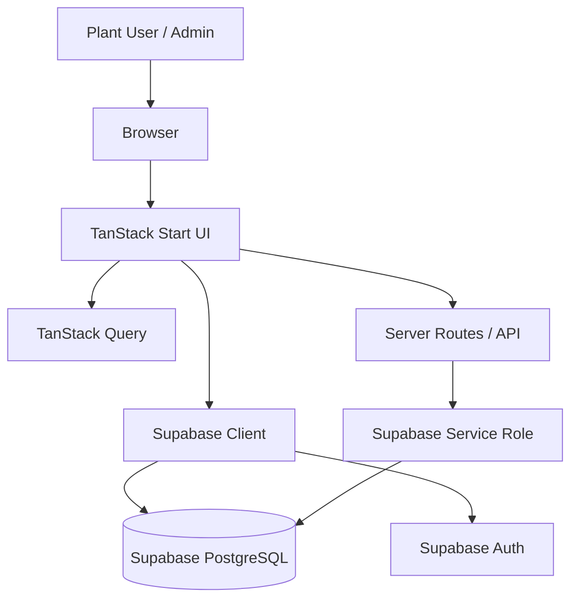

# RINL Vizag Steel Plant - Centralized Delay Analysis System

[](https://tanstack.com/start)
[](https://react.dev/)
[](https://www.typescriptlang.org/)
[](https://supabase.com/)
[](https://vercel.com/)

> Real-time delay tracking, reporting, and admin control for Visakhapatnam Steel Plant.

## Overview

This is a full-stack operations app for capturing equipment delays, reviewing trends, and managing access in one place. It replaces fragmented spreadsheets with a centralized workflow for plant users and administrators.

At a glance, the app is built to:

- record delay events quickly with structured plant metadata
- show operational status through dashboards and charts
- keep user access role-aware and secure
- expose lightweight API routes for health checks and public metrics
- support deployment as an SSR web app on Vercel

### What it covers

- Delay entry with shop, equipment, agency, timestamp, and duration
- Dashboards with KPI cards and charts
- Filterable reports and CSV export
- Self-registration for employees
- Admin-driven user provisioning and role management
- Public health and landing-stat endpoints for runtime checks

## Screenshots

Add these when publishing the project page:

- dashboard overview
- delay entry form
- admin user management
- reports and export flow

### Core workflows

1. A plant user signs in or self-registers with employee details.
2. Delay data is entered and persisted in Supabase PostgreSQL.
3. Reports and dashboards read the same data to surface trends.
4. Admins manage users, roles, and active status from protected screens.
5. Public endpoints provide quick checks for uptime and landing-page statistics.

## Tech Stack

| Area | Stack |
| --- | --- |
| Frontend | React 19, TanStack Start, TanStack Router, TanStack Query, Tailwind CSS 4, Recharts, Lucide React, shadcn/ui primitives |
| Backend | TanStack Start server routes, Nitro, Zod, Supabase JS, Vercel Functions |
| Database | Supabase PostgreSQL, RLS policies, SQL migrations, indexes |
| Auth | Supabase Auth, JWT sessions, app roles |
| Tooling | Vite, ESLint, Prettier, TypeScript |
| Deploy | Vercel |

The main libraries in use are TanStack Start, TanStack Router, TanStack Query, Supabase JS, Zod, Recharts, and the shadcn/ui component set.

## Architecture



### Runtime model

- SSR-first app with TanStack Start
- File-based routing and protected authenticated routes
- Client-side data fetching and caching with TanStack Query
- Supabase used for auth, persistence, and authorization enforcement
- Vercel hosts the production build and server routes

## Key Features

- Auth with employee-number or email-based login resolution
- Role-based access for normal users, department admins, and system admins
- Protected dashboards and authenticated route guards
- Admin employee creation and user activation/deactivation
- Delay analytics and report filtering for plant operations
- Server-side health and metrics routes for deployment support

## API Surface

| Route | Purpose |
| --- | --- |
| `GET /api/health` | Deployment health check |
| `GET /api/landing-stats` | Public landing-page metrics |
| `POST /api/register` | Employee self-registration |
| `POST /api/admin/create-user` | Admin user provisioning |
| `POST /api/public/seed` | Public seed/bootstrap helper |

Related server helpers live in `src/lib/`:

- `register.functions.ts` for registration and login email resolution
- `admin.functions.ts` for admin employee creation
- `public-stats.functions.ts` for public metrics

## Data and Security

- Core tables include `profiles`, `user_roles`, `eqpt_master`, and `delays_data`
- Supabase RLS protects table access at the database layer
- Admin mutations stay on trusted server handlers only
- Protected routes check auth before private screens render
- Bearer-token verification is used for sensitive admin provisioning flows

The important server helpers are:

- `src/lib/register.functions.ts` for self-registration and login-email resolution
- `src/lib/admin.functions.ts` for admin user creation
- `src/lib/public-stats.functions.ts` for public metrics
- `src/lib/auth.ts` for role labels, departments, agencies, and login helpers

## Repo Layout

- `src/routes/` - application pages and API routes
- `src/components/` - reusable UI and layout components
- `src/lib/` - server functions, auth helpers, and utilities
- `src/integrations/supabase/` - client and server Supabase setup
- `docs/` - deployment, design, and interview support notes
- `supabase/` - schema and migration files

## Environment Variables

Copy `.env.example` to `.env` and fill in the real values.

Client-safe variables:

- `VITE_SUPABASE_URL`
- `VITE_SUPABASE_PUBLISHABLE_KEY`
- `VITE_SUPABASE_PROJECT_ID`

Server-only variables:

- `SUPABASE_URL`
- `SUPABASE_PUBLISHABLE_KEY`
- `SUPABASE_SERVICE_ROLE_KEY`
- `SEED_SECRET`
- `SITE_URL`

## API and Data Flow

The app follows a simple flow: browser -> TanStack Start UI -> server route or Supabase client -> PostgreSQL. Public data uses lightweight handlers, while sensitive mutations stay behind authenticated server code.

The most important endpoints are:

- `GET /api/health` for uptime checks
- `GET /api/landing-stats` for homepage metrics
- `POST /api/register` for self-registration
- `POST /api/admin/create-user` for admin provisioning
- `POST /api/public/seed` for bootstrap/setup support

## Setup

```bash
npm install
npm run dev
```

Useful scripts:

```bash
npm run build
npm run lint
npm run format
```

## Deployment

The project is configured for Vercel and SSR deployment. See [docs/DEPLOYMENT.md](docs/DEPLOYMENT.md) for deployment notes and [docs/SYSTEM_DESIGN.md](docs/SYSTEM_DESIGN.md) for a deeper architecture walkthrough.

For a deeper technical read, [docs/PROJECT_DEFENSE_GUIDE.md](docs/PROJECT_DEFENSE_GUIDE.md) has the interview-style summary.

## Notes

- Use the Supabase environment variables from `.env.example`
- Keep migrations in `supabase/migrations/`
