# RINL Vizag Steel Plant — Centralized Delay Analysis System

[](https://tanstack.com/start)
[](https://react.dev/)
[](https://www.typescriptlang.org/)
[](https://supabase.com/)
[](https://vercel.com/)
[]()

> **A real-time, role-aware delay monitoring platform for Visakhapatnam Steel Plant.**
> Built to replace spreadsheet-driven delay tracking with a fast, secure, and visually polished operational system.

---

## Hero Section

### Project Overview

RINL Vizag Steel Plant — Centralized Delay Analysis System is a full-stack operational web application designed to capture, classify, analyze, and report equipment delays across plant shops in a single, centralized interface.

It gives plant teams one place to:

- Log production delay events in real time
- View live operational dashboards
- Filter and export detailed reports
- Manage employee access by role
- Keep delay data clean, structured, and auditable

### Business Problem Solved

Before systems like this, industrial delay records often live in Excel sheets, email threads, or isolated departmental logs. That leads to:

- Inconsistent formats
- Slow reporting cycles
- No live visibility for management
- Weak accountability
- Poor root-cause analysis

This project solves that by turning delay tracking into a centralized digital workflow with secure access control and immediate reporting.

### Banner Image Placeholder

> **Project banner placeholder:** add a wide hero image or product screenshot here when publishing the README on GitHub.

---

## Executive Summary

This project is a steel-plant operations dashboard focused on delay analysis. It was built to help employees and managers capture delay data, review trends, and support operational decisions with accurate, structured information.

### What it does

- Captures equipment delay records with shop, equipment, agency, timestamp, and duration
- Renders a live dashboard with key plant-level metrics
- Supports filterable delay reports and CSV export
- Enables secure user registration and admin-driven provisioning
- Uses role-based access to separate normal users from administrators

### Why it was built

The application was created to reduce the manual overhead of plant reporting and to give the organization a faster, more reliable way to understand where production time is being lost.

### Target users

- Plant operators
- Shop engineers
- Department administrators
- PPM administrators
- System administrators
- Technical reviewers and interview panels

### Business value

- Faster delay logging
- Better accountability
- More reliable reporting
- Easier operational analysis
- Improved visibility across departments

### Real-world impact

In a large industrial environment, even small improvements in delay tracking can improve planning, maintenance prioritization, and communication between departments. This system helps convert production issues into usable data.

> **Architecture callout:** The current implementation uses TanStack Start with SSR, Supabase for authentication and database access, RLS policies for security, and Vercel for deployment.

---

## Feature Highlights

| Area | Highlights | Business Value |
| --- | --- | --- |
| User Experience | Clean landing page, responsive layout, dark/light theme toggle, fast sign-in | Easier adoption by plant users |
| Delay Logging | Structured delay entry form, cascading equipment selection, auto duration calculation | Better data quality |
| Analytics | Dashboard KPIs, bar chart, pie chart, report filters | Faster decision-making |
| Admin Controls | Role management, active/inactive status control, user provisioning | Safer access governance |
| Security | Supabase Auth, RLS, bearer-token admin route protection, protected routes | Lower operational risk |

### User Features

- Sign in with employee number or email
- Self-register with employee details
- Log equipment delay events
- View live summaries and charts
- Filter reports by shop and date range
- Export reports to CSV

### Admin Features

- Create new employees
- Assign roles
- Activate or deactivate users
- Review user lists with profile and role context
- Restrict sensitive screens to admin roles only

### System Features

- SSR-first routing with TanStack Start
- Centralized route tree generation
- Query caching with TanStack Query
- Reusable UI components from shadcn/ui style primitives
- Health endpoint for deployment checks
- Public landing statistics endpoint

### Security Features

- Supabase authentication sessions
- Row Level Security policies on core tables
- Admin-only database mutations
- Authenticated route guard before protected pages load
- Bearer-token verification for admin provisioning
- Server-side Supabase service role access only in trusted handlers

---

## Technology Stack

### Frontend

| Technology | Purpose |
| --- | --- |
| React 19 | UI rendering |
| TanStack Start | Full-stack React framework with SSR |
| TanStack Router | File-based routing and route guards |
| TanStack Query | Server-state caching and invalidation |
| Tailwind CSS 4 | Styling system |
| Recharts | Charting and visualization |
| Lucide React | Iconography |
| shadcn/ui primitives | Accessible UI components |

### Backend

| Technology | Purpose |
| --- | --- |
| TanStack Start server routes | API and SSR handlers |
| Nitro | Server runtime for deployment targets |
| Zod | Request validation |
| Supabase JS | Backend and auth client integration |
| Vercel Functions | Production execution environment |

### Database

| Technology | Purpose |
| --- | --- |
| Supabase PostgreSQL | Primary data store |
| RLS policies | Row-level access control |
| SQL migrations | Schema and policy management |
| Indexes | Query performance tuning |

### Authentication

| Technology | Purpose |
| --- | --- |
| Supabase Auth | User sign-in and session handling |
| JWT sessions | Browser authentication state |
| Role tables | App-level authorization |

### Deployment

| Technology | Purpose |
| --- | --- |
| Vercel | Hosting and edge deployment |
| Nitro Vercel preset | Server-side build target |
| Vite | Local development and production bundling |

### DevOps

| Technology | Purpose |
| --- | --- |
| ESLint | Code quality checks |
| Prettier | Formatting |
| Vite build | Production bundling |
| Supabase migrations | Controlled schema evolution |

### Testing and Validation

| Layer | Current Coverage |
| --- | --- |
| Static checks | ESLint |
| Build validation | Vite production build |
| Runtime smoke checks | Health route and landing stats route |

---

## System Architecture

### High-Level Architecture

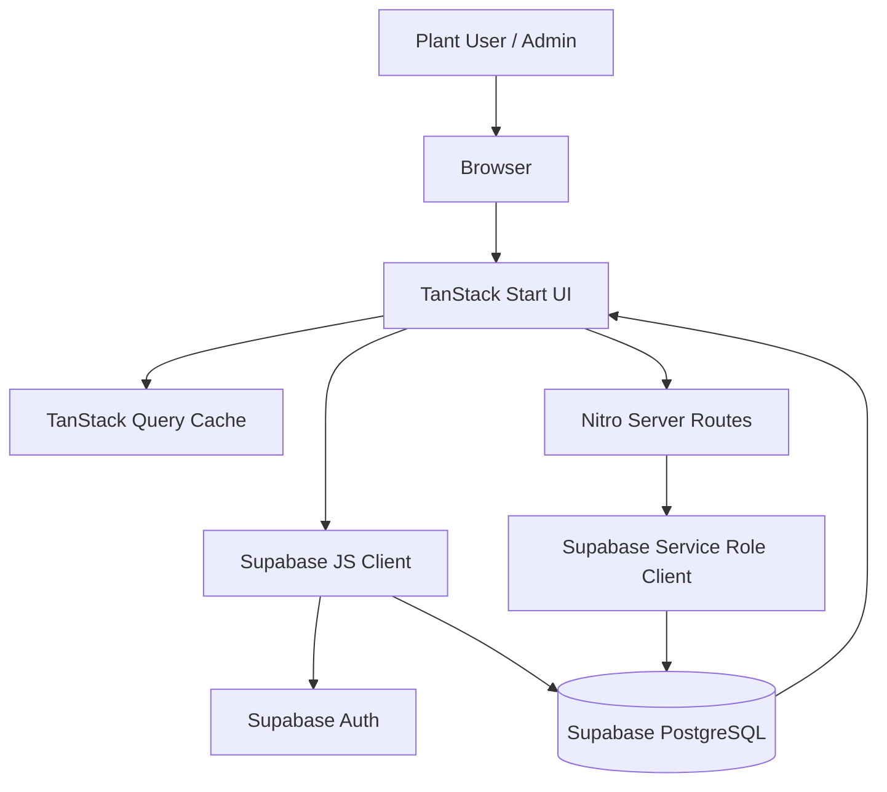

### Low-Level Architecture

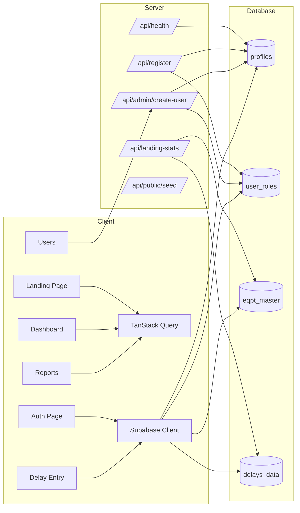

### Component Diagram

```mermaid
graph TB
  Root[__root.tsx]
  Theme[ThemeProvider]
  Query[QueryClientProvider]
  Toast[Toaster]
  AuthRoute[/_authenticated/route.tsx]
  Sidebar[AppSidebar]
  TopBar[Top Bar]
  Dash[Dashboard]
  Delay[Delay Entry]
  Reports[Reports]
  Users[Users]

  Root --> Theme --> Query --> Toast
  Root --> AuthRoute
  AuthRoute --> Sidebar
  AuthRoute --> TopBar
  AuthRoute --> Dash
  AuthRoute --> Delay
  AuthRoute --> Reports
  AuthRoute --> Users
```

### Layered Architecture

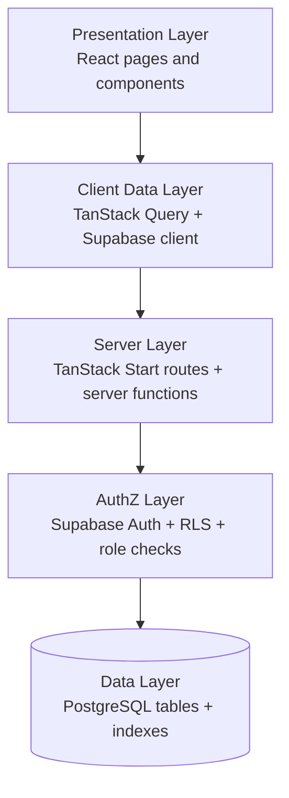

### Microservice Architecture

> **Not currently applicable.** The application is implemented as a modular monolith with SSR pages, API routes, and server functions. If the platform grows, these bounded contexts can be split into separate services later.

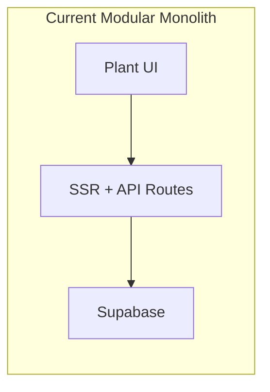

### Deployment Architecture

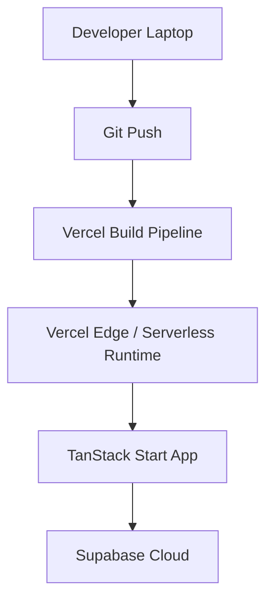

### Infrastructure Architecture

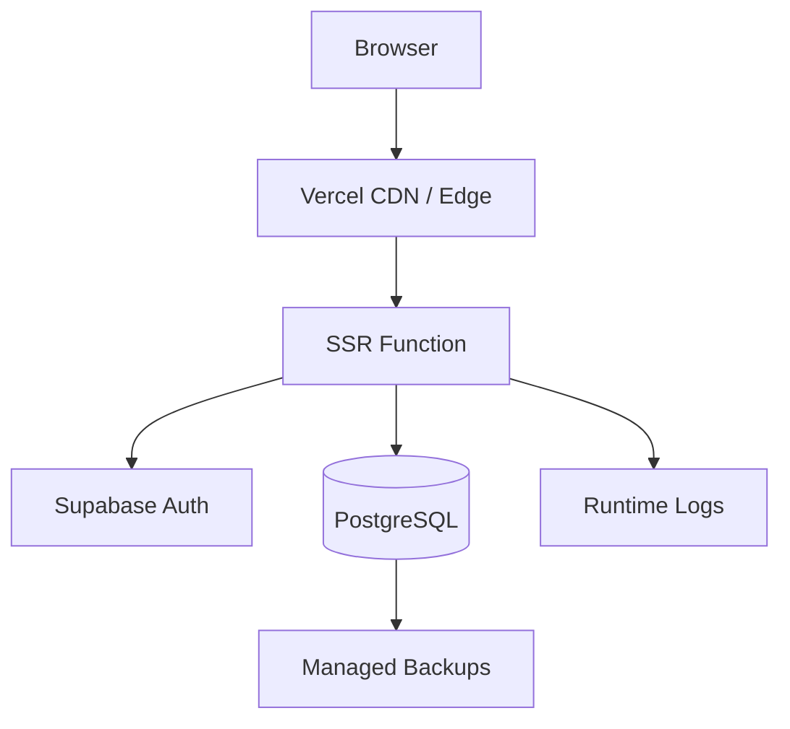

### Cloud Architecture

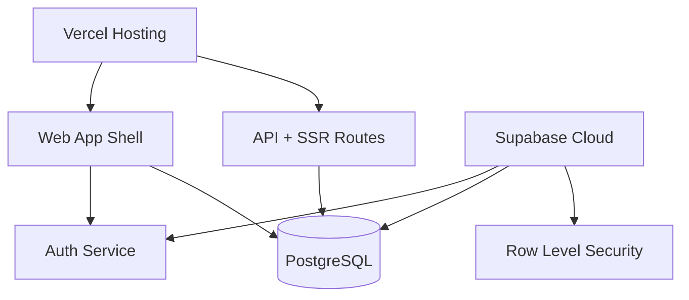

### Network Architecture

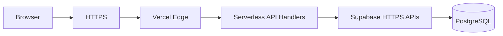

### Security Architecture

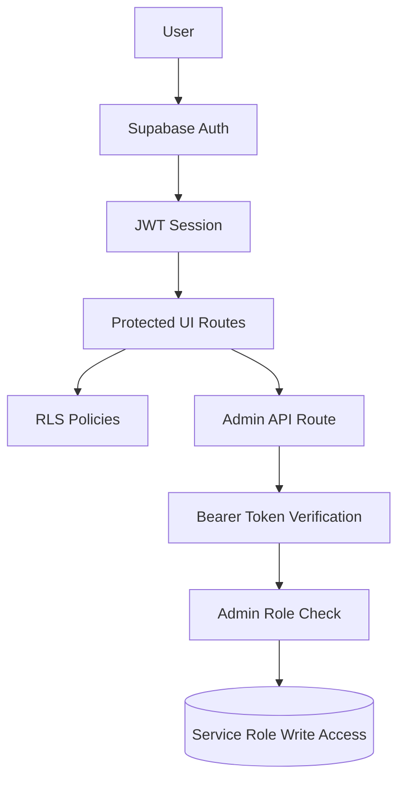

### Monitoring Architecture

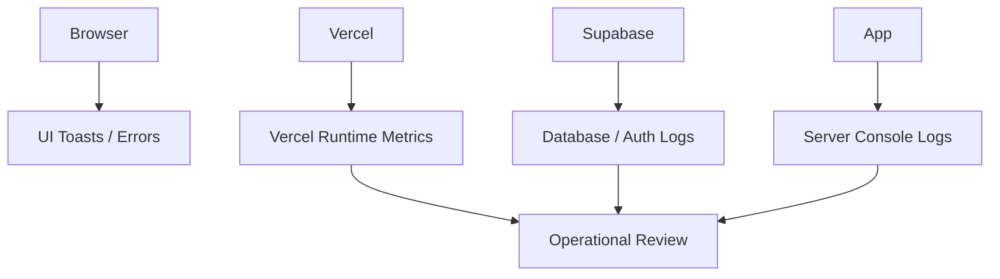

---

## Database Design

The application currently uses four core tables plus one custom enum:

- `profiles`
- `user_roles`
- `eqpt_master`
- `delays_data`
- `app_role` enum

### ER Diagram

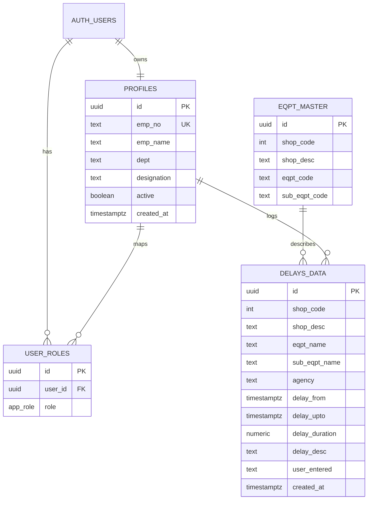

### Table Relationship Diagram

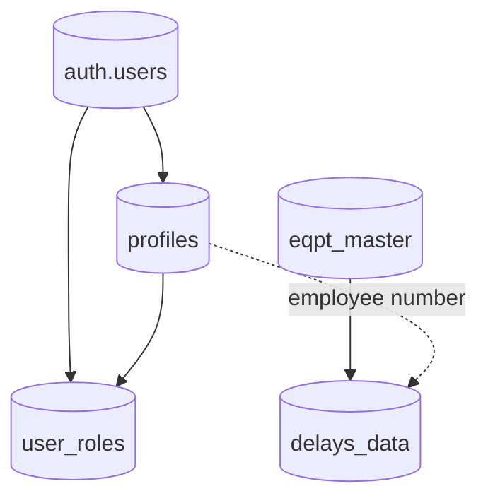

### Database Flow Diagram

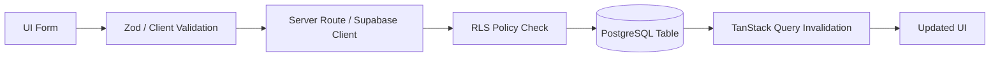

### Normalized Schema Diagram

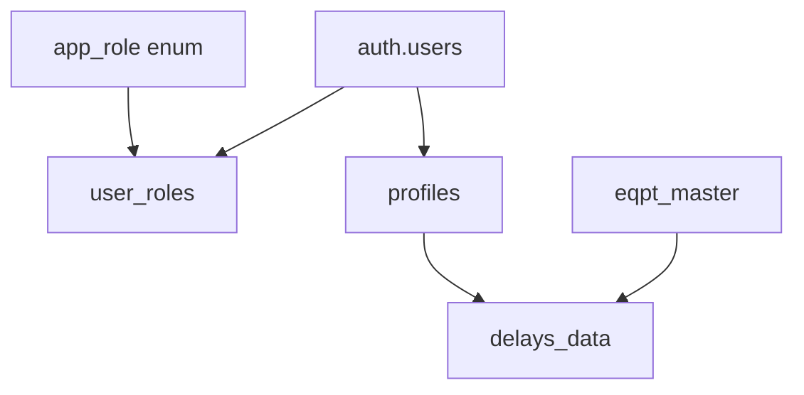

### Data Lifecycle Diagram

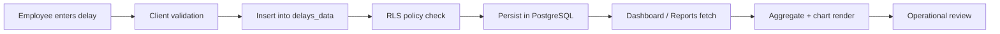

### Table Reference Guide

#### 1) profiles

Purpose: Stores the employee profile that is linked to the Supabase auth user.

Columns:

- `id` - primary key, references `auth.users(id)`
- `emp_no` - unique employee number
- `emp_name` - employee display name
- `dept` - shop or department code/name
- `designation` - designation or job title
- `active` - user status flag
- `created_at` - record creation timestamp

Relationships:

- One-to-one with `auth.users`
- One-to-many from `profiles` to `user_roles` in practice through `user_id`

Constraints:

- Primary key on `id`
- Unique constraint on `emp_no`
- `active` defaults to `true`
- Row Level Security enabled

#### 2) user_roles

Purpose: Stores application roles for authorization.

Columns:

- `id` - surrogate primary key
- `user_id` - references `auth.users(id)`
- `role` - `app_role` enum value

Relationships:

- Each user can have one or more role records
- Admin checks are derived from this table through `is_admin()`

Constraints:

- Unique `(user_id, role)` pair
- RLS enabled

#### 3) eqpt_master

Purpose: Equipment lookup table used by the delay entry form.

Columns:

- `id` - primary key
- `shop_code` - plant shop identifier
- `shop_desc` - shop description
- `eqpt_code` - equipment name/code
- `sub_eqpt_code` - sub-equipment name/code

Relationships:

- Supplies options for cascading shop/equipment/sub-equipment selection

Constraints:

- RLS enabled
- Indexed by `shop_code`

#### 4) delays_data

Purpose: Main fact table for delay events.

Columns:

- `id` - primary key
- `shop_code` - numerical shop identifier
- `shop_desc` - display name of the shop
- `eqpt_name` - equipment name
- `sub_eqpt_name` - sub-equipment name
- `agency` - responsible agency
- `delay_from` - start timestamp
- `delay_upto` - end timestamp
- `delay_duration` - computed duration in hours
- `delay_desc` - free-text delay description
- `user_entered` - employee number of logger
- `created_at` - creation timestamp

Relationships:

- Reads from `eqpt_master` for equipment mapping
- Logically tied to the employee profile via `user_entered`

Constraints:

- RLS enabled
- Authenticated insert policy
- Admin-only update and delete policies
- Indexed for time-based and shop-based filtering

#### 5) app_role enum

Purpose: Standardizes role values.

Values:

- `sys_admin`
- `dept_admin`
- `dept_user`
- `ppm_admin`
- `ppm_user`

---

## User Flow Diagrams

### User Registration Flow

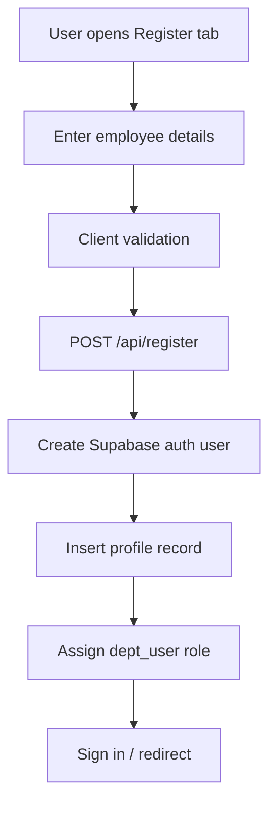

### Login Flow

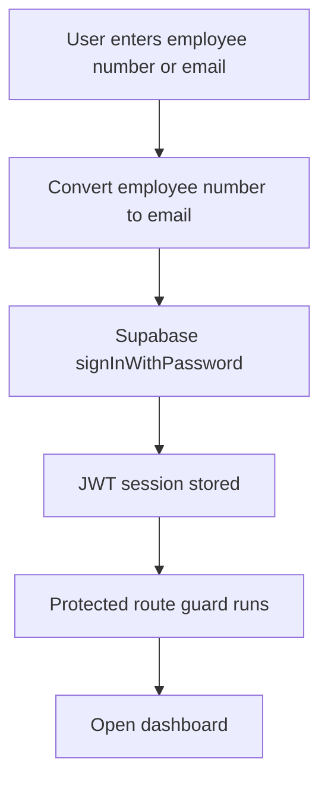

### Dashboard Flow

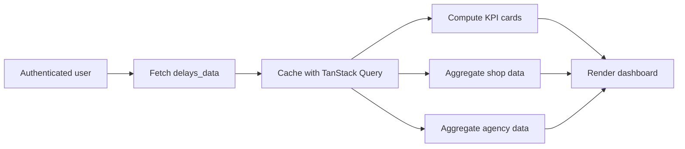

### CRUD Operations Flow

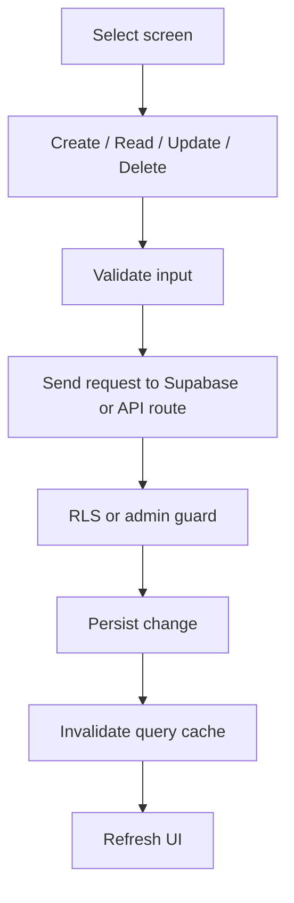

### Approval Flow

```mermaid
flowchart TD
  A[New employee registration] --> B[Profile created]
  B --> C[Default role assigned]
  C --> D{Admin review required?}
  D -->|Yes| E[Admin updates role or active flag]
  D -->|No| F[User can operate normally]
  E --> G[Access recalculated]
```

### Report Generation Flow

```mermaid
flowchart LR
  A[Open Reports] --> B[Load delay records]
  B --> C[Filter by shop/date]
  C --> D[Sort records]
  D --> E[Render table/chart]
  E --> F[Export CSV]
```

### Notification Flow

```mermaid
flowchart TD
  A[Action submitted] --> B[Success or error response]
  B --> C[Show toast notification]
  B --> D[Invalidate affected queries]
  D --> E[Updated UI]
```

### End-to-End User Journey

```mermaid
flowchart TD
  A[Landing page] --> B[Sign in / register]
  B --> C[Auth session created]
  C --> D[Dashboard]
  D --> E[Delay entry]
  D --> F[Reports]
  D --> G[Admin tools]
  E --> H[Data stored]
  H --> F
  F --> I[Operational decisions]
```

---

## Backend Architecture

### API Flow

```mermaid
flowchart LR
  Client --> Route[/TanStack route handler/]
  Route --> Validate[Zod validation]
  Validate --> Guard[Auth / role guard]
  Guard --> Service[Supabase service or query logic]
  Service --> DB[(PostgreSQL)]
  DB --> Response[JSON response]
  Response --> Client
```

### Request Lifecycle

```mermaid
flowchart TD
  A[HTTP request] --> B[Route resolution]
  B --> C[Parse body or params]
  C --> D[Validate payload]
  D --> E[Check auth / token]
  E --> F[Run DB query or mutation]
  F --> G[Map errors to response]
  G --> H[Return JSON / HTML]
```

### Authentication Flow

```mermaid
sequenceDiagram
  actor User
  participant UI as Auth Page
  participant Supabase as Supabase Auth
  participant Route as Protected Route
  User->>UI: Enter login credentials
  UI->>Supabase: signInWithPassword()
  Supabase-->>UI: Session + JWT
  UI->>Route: Navigate to protected area
  Route->>Supabase: getUser()
  Supabase-->>Route: Authenticated user
```

### Authorization Flow

```mermaid
flowchart TD
  A[Authenticated request] --> B[Read role from user_roles]
  B --> C{Role is admin?}
  C -->|Yes| D[Allow sensitive action]
  C -->|No| E[Restrict to read-only / self-service]
  D --> F[Admin mutation or management screen]
  E --> G[Standard user experience]
```

### Service Layer Flow

```mermaid
flowchart LR
  UI --> SRV[Service Function]
  SRV --> RULES[Business rules]
  RULES --> REPO[Database access]
  REPO --> DB[(PostgreSQL)]
  DB --> SRV --> UI
```

### Repository Pattern Flow

```mermaid
flowchart TD
  A[Page / Route] --> B[Service]
  B --> C[Repository function]
  C --> D[Supabase query builder]
  D --> E[(Database)]
  E --> F[Mapped domain data]
  F --> B --> A
```

### Error Handling Flow

```mermaid
flowchart TD
  A[Operation fails] --> B[Catch error]
  B --> C[Log details]
  C --> D[Return safe message]
  D --> E[Show toast / error page]
  E --> F[User retries or navigates away]
```

---

## Frontend Architecture

### Component Hierarchy

```mermaid
graph TD
  App[App Shell] --> Root[__root.tsx]
  Root --> Theme[ThemeProvider]
  Root --> Query[QueryClientProvider]
  Root --> Toast[Toaster]
  Root --> Landing[Landing Page]
  Root --> Auth[Auth Page]
  Root --> Protected[Authenticated Layout]
  Protected --> Sidebar[AppSidebar]
  Protected --> TopBar[Top Bar]
  Protected --> Pages[Dashboard / Delay Entry / Reports / Users]
```

### Routing Structure

```mermaid
graph TD
  Home[/ /] --> AuthPage[/auth/]
  Home --> ProtectedLayout[/_authenticated/]
  ProtectedLayout --> Dash[/dashboard/]
  ProtectedLayout --> Delay[/delay-entry/]
  ProtectedLayout --> Reports[/reports/]
  ProtectedLayout --> Users[/users/]
  Home --> Health[/api/health/]
  Home --> Stats[/api/landing-stats/]
  Home --> Register[/api/register/]
  Home --> AdminCreate[/api/admin/create-user/]
  Home --> Seed[/api/public/seed/]
```

### State Management Flow

```mermaid
flowchart LR
  A[User interaction] --> B[Component state]
  B --> C[TanStack Query]
  C --> D[Supabase / API data]
  D --> E[Cached result]
  E --> F[UI render]
  F --> G[Toast / routing updates]
```

### UI Rendering Flow

```mermaid
flowchart TD
  A[Route loads] --> B[SSR HTML output]
  B --> C[Hydration]
  C --> D[Auth state]
  D --> E[Conditional rendering]
  E --> F[Cards / charts / tables]
  F --> G[Responsive layout]
```

---

## Security Section

### Authentication Workflow

```mermaid
sequenceDiagram
  actor User
  participant Browser
  participant Supabase
  participant App as Protected App
  User->>Browser: Enter credentials
  Browser->>Supabase: Authenticate
  Supabase-->>Browser: Session stored
  Browser->>App: Open protected route
  App->>Supabase: getUser()
  Supabase-->>App: Valid user or redirect
```

### JWT Flow

```mermaid
flowchart LR
  Login[Login] --> JWT[JWT issued]
  JWT --> Store[Browser session storage]
  Store --> Request[Authenticated request]
  Request --> Supabase[Supabase verifies token]
  Supabase --> RLS[RLS policy evaluation]
  RLS --> DB[(Database access)]
```

### Session Management

```mermaid
flowchart TD
  A[Session created] --> B[Persist in browser]
  B --> C[onAuthStateChange listener]
  C --> D[Invalidate router and query cache]
  D --> E[Refresh user state]
  E --> F[Sign out clears session]
```

### Security Layers

```mermaid
flowchart TB
  A[UI guard] --> B[Auth session]
  B --> C[Role lookup]
  C --> D[RLS policies]
  D --> E[Server-side bearer checks]
  E --> F[Service role only on trusted paths]
  F --> G[(Data layer)]
```

### Access Control Matrix

| Action | Standard User | Department Admin | System Admin |
| --- | --- | --- | --- |
| View landing page | Yes | Yes | Yes |
| View dashboard | Yes | Yes | Yes |
| Create delay record | Yes | Yes | Yes |
| View reports | Yes | Yes | Yes |
| Add users | No | Yes | Yes |
| Change roles | No | Yes | Yes |
| Deactivate users | No | Yes | Yes |
| Update/delete delay records | No | No | Yes |

---

## Scalability Section

### Horizontal Scaling

```mermaid
flowchart LR
  LB[Load-balanced edge traffic] --> W1[SSR instance 1]
  LB --> W2[SSR instance 2]
  LB --> W3[SSR instance 3]
  W1 --> DB[(Single source of truth)]
  W2 --> DB
  W3 --> DB
```

### Vertical Scaling

```mermaid
flowchart TD
  A[More CPU / memory] --> B[Higher SSR throughput]
  B --> C[Better concurrent rendering]
  C --> D[Lower response latency]
```

### Load Balancer Architecture

```mermaid
flowchart LR
  Users --> LB[Vercel Edge / routing layer]
  LB --> SSR1[SSR worker]
  LB --> SSR2[SSR worker]
  SSR1 --> Supabase
  SSR2 --> Supabase
```

### Cache Architecture

```mermaid
flowchart TD
  A[UI request] --> B[TanStack Query cache]
  B --> C{Cache hit?}
  C -->|Yes| D[Instant render]
  C -->|No| E[Fetch from Supabase]
  E --> F[Store in cache]
  F --> D
```

### Queue Architecture

```mermaid
flowchart LR
  A[Future async task] --> Q[Queue]
  Q --> W[Worker]
  W --> N[Notification / export / audit task]
```

### Distributed System Flow

```mermaid
flowchart TD
  A[Browser] --> B[Vercel edge]
  B --> C[SSR/API]
  C --> D[Supabase Auth]
  C --> E[Supabase PostgreSQL]
  E --> F[Aggregated analytics]
  F --> A
```

---

## DevOps Section

### CI/CD Pipeline

```mermaid
flowchart LR
  Commit[Git commit] --> Lint[ESLint]
  Lint --> Build[Vite build]
  Build --> Deploy[Vercel deploy]
  Deploy --> Monitor[Runtime monitoring]
```

### Build Process

```mermaid
flowchart TD
  A[Source TypeScript/TSX] --> B[Vite bundling]
  B --> C[TanStack Start SSR build]
  C --> D[Nitro Vercel output]
  D --> E[Production assets]
```

### Deployment Workflow

```mermaid
flowchart LR
  Dev[Developer pushes code] --> Vercel[Vercel detects app]
  Vercel --> Install[Install dependencies]
  Install --> Build[Run build]
  Build --> Publish[Publish deployment]
  Publish --> Users[Live site]
```

### Release Flow

```mermaid
flowchart TD
  A[Merge to main] --> B[Automated build]
  B --> C[Deployment preview]
  C --> D[Production release]
  D --> E[Post-release verification]
```

### Monitoring Pipeline

```mermaid
flowchart LR
  App[Application] --> Logs[Console / runtime logs]
  Logs --> Review[Developer review]
  App --> Health[/api/health/]
  Health --> Status[Deployment health check]
  Status --> Review
```

---

## Sequence Diagrams

### User Login

```mermaid
sequenceDiagram
  actor User
  participant UI as Auth Page
  participant Auth as Supabase Auth
  participant App as Protected Route
  User->>UI: Enter employee number and password
  UI->>Auth: signInWithPassword()
  Auth-->>UI: Session / JWT
  UI->>App: Navigate to dashboard
  App->>Auth: getUser()
  Auth-->>App: Valid user
```

### User Registration

```mermaid
sequenceDiagram
  actor User
  participant UI as Register Form
  participant API as /api/register
  participant DB as Supabase PostgreSQL
  User->>UI: Submit employee data
  UI->>API: POST payload
  API->>DB: Create auth user + profile + role
  DB-->>API: Success
  API-->>UI: Registration OK
```

### Data Submission

```mermaid
sequenceDiagram
  actor User
  participant UI as Delay Entry
  participant DB as delays_data
  participant Cache as Query Cache
  User->>UI: Fill delay form
  UI->>DB: Insert delay record
  DB-->>UI: Saved
  UI->>Cache: Invalidate delay queries
  Cache-->>UI: Refetch on next render
```

### Data Retrieval

```mermaid
sequenceDiagram
  participant UI as Dashboard / Reports
  participant Cache as TanStack Query
  participant DB as Supabase PostgreSQL
  UI->>Cache: Request data
  Cache->>DB: Fetch if stale
  DB-->>Cache: Rows
  Cache-->>UI: Cached response
```

### Report Generation

```mermaid
sequenceDiagram
  actor User
  participant UI as Reports Page
  participant DB as delays_data
  User->>UI: Choose filters
  UI->>DB: Load matching rows
  DB-->>UI: Report dataset
  UI->>UI: Render table and chart
  User->>UI: Export CSV
```

### Admin Approval

```mermaid
sequenceDiagram
  actor Admin
  participant UI as User Management
  participant API as /api/admin/create-user
  participant Auth as Supabase Auth
  participant DB as PostgreSQL
  Admin->>UI: Create employee / set role
  UI->>API: Authorized request
  API->>Auth: Verify bearer token
  API->>DB: Create profile and role
  DB-->>API: Success
  API-->>UI: User added
```

### Notification Delivery

```mermaid
sequenceDiagram
  participant UI as Frontend
  participant Toast as Sonner Toast
  participant Cache as TanStack Query
  UI->>Toast: Show success / error
  UI->>Cache: Invalidate related query
  Cache-->>UI: Updated data
```

---

## Class Diagrams

> These are architectural class diagrams that describe the current TypeScript boundaries and data models.

### Domain Models

```mermaid
classDiagram
  class Profile {
    +string id
    +string emp_no
    +string emp_name
    +string dept
    +string designation
    +boolean active
  }

  class UserRole {
    +string id
    +string user_id
    +AppRole role
  }

  class EquipmentMaster {
    +string id
    +number shop_code
    +string shop_desc
    +string eqpt_code
    +string sub_eqpt_code
  }

  class DelayRecord {
    +string id
    +number shop_code
    +string shop_desc
    +string eqpt_name
    +string sub_eqpt_name
    +string agency
    +number delay_duration
  }

  Profile "1" --> "many" UserRole
  EquipmentMaster "1" --> "many" DelayRecord
```

### Service Classes

```mermaid
classDiagram
  class AuthProvider {
    +profile
    +role
    +isAdmin
    +signOut()
  }

  class DelayEntryPage {
    +handleSubmit()
    +fmtDuration()
  }

  class ReportsPage {
    +exportCSV()
    +filterRows()
  }

  class UsersPage {
    +setRole()
    +setActive()
    +handleAdd()
  }

  AuthProvider <.. DelayEntryPage
  AuthProvider <.. ReportsPage
  AuthProvider <.. UsersPage
```

### Repository Classes

```mermaid
classDiagram
  class SupabaseClient {
    +from(table)
    +auth
  }

  class AdminClient {
    +auth.admin.createUser()
    +from(table)
  }

  class DelayRepository {
    +insertDelay()
    +fetchDelays()
  }

  class UserRepository {
    +createProfile()
    +assignRole()
    +updateStatus()
  }

  SupabaseClient <.. DelayRepository
  AdminClient <.. UserRepository
```

### DTO Relationships

```mermaid
classDiagram
  class RegisterDTO {
    +string empNo
    +string password
    +string emp_name
    +string dept
    +string designation
    +string email
  }

  class CreateUserDTO {
    +string empNo
    +string password
    +string emp_name
    +string dept
    +string designation
    +AppRole role
  }

  class DelayDTO {
    +string shopDesc
    +string eqpt
    +string subEqpt
    +string agency
    +string from
    +string upto
    +string desc
  }

  RegisterDTO --> CreateUserDTO
  DelayDTO --> DelayRecord
```

---

## API Documentation

### API Inventory

| Endpoint | Method | Purpose | Auth |
| --- | --- | --- | --- |
| `/api/health` | `GET` | Checks deployment status and environment configuration | Public |
| `/api/landing-stats` | `GET` | Returns landing-page metrics for equipment, shops, delays, and average delay duration | Public |
| `/api/register` | `POST` | Self-registers a plant employee with default `dept_user` access | Public |
| `/api/admin/create-user` | `POST` | Admin-only employee provisioning and role assignment | Bearer token required |
| `/api/public/seed` | `POST` | Seeds demo data for initial setup | Bearer token using `SEED_SECRET` |

### 1) GET /api/health

Purpose: Verify the service is alive and environment variables are present.

Request:

```http
GET /api/health
```

Response:

```json
{
  "status": "ok",
  "timestamp": "2026-06-17T00:00:00.000Z",
  "uptime": 12345.67,
  "env": {
    "supabase_configured": true,
    "node_env": "production"
  }
}
```

Validation:

- No request body
- Environment is checked on the server

Error codes:

- `200` success

### 2) GET /api/landing-stats

Purpose: Provide public summary metrics for the landing page.

Request:

```http
GET /api/landing-stats
```

Response:

```json
{
  "equipment": 36,
  "shops": 9,
  "delays": 105,
  "avgHours": 243.7
}
```

Validation:

- No body required
- Metrics are computed from `eqpt_master` and `delays_data`

Error codes:

- Falls back to zeroed metrics if Supabase access fails

### 3) POST /api/register

Purpose: Allow a worker to create their own account.

Request:

```json
{
  "empNo": "EMP3050",
  "password": "secret123",
  "emp_name": "Ramesh Kumar",
  "dept": "SMS",
  "designation": "Engineer",
  "email": "ramesh@example.com"
}
```

Response:

```json
{ "ok": true }
```

Validation:

- `empNo`: 3-40 chars, letters/numbers/`-`/`_`
- `password`: 6-72 chars
- `emp_name`: 2-120 chars
- `dept`: required
- `designation`: optional
- `email`: optional, must be valid if provided

Error codes:

- `400` invalid JSON or validation failure
- `409` employee number already registered
- `500` Supabase or server configuration error

### 4) POST /api/admin/create-user

Purpose: Create a user with a specific role from the admin UI.

Request:

```json
{
  "empNo": "EMP5001",
  "password": "secret123",
  "emp_name": "Anita Das",
  "dept": "PPM",
  "designation": "Manager",
  "role": "dept_admin"
}
```

Headers:

```http
Authorization: Bearer <supabase-access-token>
```

Response:

```json
{ "ok": true, "id": "uuid" }
```

Validation:

- Token must be present and valid
- Caller must have an admin role
- Payload must match the Zod schema

Error codes:

- `400` invalid JSON or validation failure
- `401` missing or invalid bearer token
- `403` caller is not an admin
- `500` user creation or profile insertion failure

### 5) POST /api/public/seed

Purpose: Seed demo users only when `SEED_SECRET` is configured.

Request:

```http
POST /api/public/seed
Authorization: Bearer <SEED_SECRET>
```

Response:

```json
{ "seeded": true, "count": 5 }
```

Validation:

- Bearer secret must match `SEED_SECRET`
- Seeding stops if profiles already exist

Error codes:

- `401` unauthorized

### API Interaction Diagram

```mermaid
sequenceDiagram
  actor Client
  participant Route as API Route
  participant Supabase as Supabase Admin Client
  participant DB as PostgreSQL
  Client->>Route: Request
  Route->>Route: Validate request
  Route->>Supabase: Query / mutate
  Supabase->>DB: Execute SQL
  DB-->>Supabase: Result
  Supabase-->>Route: Data
  Route-->>Client: JSON response
```

---

## Performance Section

The project is optimized for fast reads and predictable operational usage.

### Optimization Techniques

- TanStack Query caches API and database reads on the client
- SSR reduces initial content delay on first page load
- Route-level code splitting keeps public and protected screens separate
- Recharts runs on already-aggregated data rather than raw DOM-heavy widgets
- Supabase queries use targeted column selection instead of over-fetching

### Database Indexing

Current indexes in the migration set:

- `idx_delays_data_delay_from`
- `idx_delays_data_created_at`
- `idx_delays_data_shop_code`
- `idx_delays_data_agency`
- `idx_delays_data_user_entered`
- `idx_delays_data_shop_from`
- `idx_eqpt_master_shop_code`
- `idx_profiles_emp_no`
- `idx_user_roles_user_id`

### Caching

```mermaid
flowchart LR
  Query[Client query] --> Cache{Cache hit?}
  Cache -->|Yes| Fast[Render immediately]
  Cache -->|No| Fetch[Fetch from database]
  Fetch --> Store[Store in cache]
  Store --> Fast
```

### Query Optimization

```mermaid
flowchart TD
  A[Select only required columns] --> B[Apply indexed filters]
  B --> C[Use ordered timestamp fields]
  C --> D[Aggregate in memory for charts]
  D --> E[Render compact UI]
```

### Response Optimization

```mermaid
flowchart LR
  DB[(Database rows)] --> S[Small JSON payloads]
  S --> Q[Client cache]
  Q --> UI[Fast visual update]
```

---

## Future Enhancements

<details>
<summary>Roadmap and version plan</summary>

### Version 2.0

```mermaid
flowchart LR
  A[Version 2.0] --> B[Advanced analytics]
  A --> C[Scheduled exports]
  A --> D[Email notifications]
  A --> E[Better audit trails]
```

### Version 3.0

```mermaid
flowchart LR
  A[Version 3.0] --> B[Multi-site support]
  A --> C[Predictive delay trends]
  A --> D[Role delegation workflows]
  A --> E[Mobile-first operator mode]
```

### Enterprise Version

```mermaid
flowchart LR
  A[Enterprise] --> B[SSO / SAML]
  A --> C[Audit dashboards]
  A --> D[Data warehouse integration]
  A --> E[Advanced observability]
  A --> F[Policy management]
```

</details>

---

## Testing

<details>
<summary>Testing architecture and quality gates</summary>

### Test Architecture Diagram

```mermaid
flowchart TB
  Unit[Unit tests] --> Integration[Integration tests]
  Integration --> E2E[End-to-end tests]
  E2E --> Release[Release gate]
```

### Test Pyramid

```mermaid
graph TD
  A[Many unit tests] --> B[Some integration tests]
  B --> C[Few end-to-end tests]
```

### Coverage Strategy

| Layer | What to test |
| --- | --- |
| UI | Form validation, route guards, chart rendering |
| Data | Query results, invalidation, error paths |
| API | Status codes, auth checks, payload validation |
| Database | RLS policies, role access, index usage |

Current validation available in the repository:

- `npm run lint`
- `npm run build`

Recommended future additions:

- Vitest for unit/component tests
- Playwright for full journey tests

</details>

---

## Folder Structure

<details>
<summary>Project tree and folder explanations</summary>

```text
.
├── bunfig.toml
├── components.json
├── eslint.config.js
├── package.json
├── seed.sql
├── setup.sql
├── tsconfig.json
├── vercel.json
├── vite.config.ts
├── docs/
│   ├── DEPLOYMENT.md
│   ├── INTERVIEW_DESIGN.md
│   ├── PROJECT_DEFENSE_GUIDE.md
│   ├── SYSTEM_DESIGN.md
│   └── schema.sql
├── public/
│   └── robots.txt
├── src/
│   ├── router.tsx
│   ├── routeTree.gen.ts
│   ├── server.ts
│   ├── start.ts
│   ├── styles.css
│   ├── assets/
│   ├── components/
│   ├── hooks/
│   ├── integrations/
│   ├── lib/
│   └── routes/
└── supabase/
    ├── config.toml
    └── migrations/
```

### Root Files

- `package.json` - dependencies, scripts, and project metadata
- `vite.config.ts` - build and dev-server configuration
- `vercel.json` - deployment configuration
- `tsconfig.json` - TypeScript compiler settings
- `eslint.config.js` - linting rules
- `bunfig.toml` - Bun runtime configuration
- `setup.sql` / `seed.sql` - database bootstrap data and helpers

### `docs/`

- `DEPLOYMENT.md` - deployment notes
- `INTERVIEW_DESIGN.md` - interview-oriented design notes
- `PROJECT_DEFENSE_GUIDE.md` - detailed defense and viva material
- `SYSTEM_DESIGN.md` - higher-level architecture reference
- `schema.sql` - SQL schema reference

### `public/`

- Static assets that are served directly by the web server

### `src/`

- `routes/` - TanStack Router file-based routes
- `components/` - reusable UI and layout components
- `integrations/` - Supabase client setup and auth helpers
- `lib/` - business constants, utilities, and server helpers
- `hooks/` - local React hooks
- `assets/` - hero images and media assets

### `src/routes/`

- `__root.tsx` - root shell, metadata, theme provider, query provider, toaster
- `index.tsx` - landing page
- `auth.tsx` - sign-in and registration page
- `_authenticated/` - protected dashboard layout and authenticated pages
- `api/` - API routes for health, landing stats, registration, admin provisioning, and demo seeding

### `src/routes/_authenticated/`

- `route.tsx` - protected layout with sidebar and top bar
- `dashboard.tsx` - KPI cards and charts
- `delay-entry.tsx` - delay logging form
- `reports.tsx` - filterable reporting and CSV export
- `users.tsx` - user administration screen

### `supabase/`

- `config.toml` - local Supabase project configuration
- `migrations/` - SQL migrations for schema, policies, and indexes

</details>

---

## Screenshots

<details>
<summary>Screenshot placeholders for GitHub</summary>

| Screen | Placeholder |
| --- | --- |
| Landing page | Add a full-width hero screenshot here |
| Dashboard | Add KPI cards + chart screenshot here |
| Reports | Add the report table and export view here |
| Admin panel | Add the user management screen here |
| Analytics | Add a chart-heavy analytics capture here |

Recommended captures:

- 1600 px wide desktop screenshots
- One dark-theme capture and one light-theme capture if possible
- Crop to show the layout, not the browser chrome

</details>

---

## Installation Guide

### Prerequisites

- Node.js 20 or newer
- A Supabase project
- Vercel account for deployment
- Access to the project environment variables

### Setup Steps

1. Clone the repository.
2. Install dependencies with your preferred package manager.
3. Create a `.env` or `.env.local` file.
4. Add the required Supabase variables.
5. Run the development server.

### Environment Variables

```bash
VITE_SUPABASE_URL=
VITE_SUPABASE_PUBLISHABLE_KEY=
SUPABASE_URL=
SUPABASE_PUBLISHABLE_KEY=
SUPABASE_SERVICE_ROLE_KEY=
SEED_SECRET=
```

### Local Development

```bash
npm install
npm run dev
```

The dev server runs on port `8080`.

### Build Instructions

```bash
npm run build
npm run preview
```

### Deployment Instructions

1. Push the repository to GitHub.
2. Connect the repository to Vercel.
3. Add all required environment variables in Vercel.
4. Deploy the app.
5. Verify `/api/health` after deployment.

> **Note:** The build is configured for the Vercel preset through Nitro in `vite.config.ts`.

---

## Project Metrics

| Metric | Current Value |
| --- | --- |
| Core database tables | 4 |
| Custom role enum | 1 |
| Public API routes | 4 |
| Admin API routes | 1 |
| Demo seeding routes | 1 |
| Authenticated page routes | 4 |
| Public page routes | 2 |
| Route modules in tree | 13 |
| Core UI component families | 40+ |
| Database indexes | 9 |

---

## Architecture Decisions

<details>
<summary>Why these choices were made</summary>

### Why TanStack Start

- It gives the project a modern SSR-capable React architecture
- File-based routing keeps the codebase easy to navigate
- Server routes and client components live in one mental model

### Why Supabase

- It provides authentication and PostgreSQL in one managed platform
- It makes RLS-based security practical for a small team
- It reduces infrastructure overhead for reviewers and maintainers

### Why TanStack Query

- Delay data is mostly read-heavy and benefits from caching
- Query invalidation maps naturally to forms and table updates
- It keeps dashboard refresh logic simple

### Why Recharts

- It is sufficient for KPI and operational charts
- The charts remain readable and easy to maintain

### Why Tailwind CSS

- Rapid development speed
- Consistent industrial-themed design tokens
- Easy responsive layout control

### Tradeoffs

- SSR adds build complexity, but improves first render quality
- Supabase RLS is powerful, but requires careful policy design
- The project favors a modular monolith over microservices for speed and clarity

### Alternatives Considered

- Next.js - strong option, but the project is already aligned around TanStack Start
- Firebase - simpler auth, but PostgreSQL and RLS fit this data model better
- Custom Express backend - more control, but more infrastructure overhead

</details>

---

## Conclusion

RINL Vizag Steel Plant — Centralized Delay Analysis System is built to turn operational delay data into something people can actually use: visible, searchable, secure, and decision-ready.

It delivers real business value by reducing manual reporting work, improving accountability, and giving plant teams a cleaner view of delay patterns. Technically, it demonstrates strong full-stack engineering practice through SSR, secure auth, role-based access, schema design, and maintainable UI composition.

The project is already a strong foundation for future expansion into advanced analytics, enterprise role governance, and deeper operational intelligence.

---

## Quick Start

```bash
npm install
npm run dev
```

Open the app in your browser, sign in, and explore the dashboard, delay entry form, reports, and admin tools.
# RINL Vizag Steel Plant — Centralized Delay Analysis System

[](https://tanstack.com/start)
[](https://react.dev/)
[](https://www.typescriptlang.org/)
[](https://supabase.com/)
[](https://vercel.com/)
[]()

> **A real-time, role-aware delay monitoring platform for Visakhapatnam Steel Plant.**
> Built to replace spreadsheet-driven delay tracking with a fast, secure, and visually polished operational system.

---

## Hero Section

### Project Overview

RINL Vizag Steel Plant — Centralized Delay Analysis System is a full-stack operational web application designed to capture, classify, analyze, and report equipment delays across plant shops in a single, centralized interface.

It gives plant teams one place to:

- Log production delay events in real time
- View live operational dashboards
- Filter and export detailed reports
- Manage employee access by role
- Keep delay data clean, structured, and auditable

### Business Problem Solved

Before systems like this, industrial delay records often live in Excel sheets, email threads, or isolated departmental logs. That leads to:

- Inconsistent formats
- Slow reporting cycles
- No live visibility for management
- Weak accountability
- Poor root-cause analysis

This project solves that by turning delay tracking into a centralized digital workflow with secure access control and immediate reporting.

### Banner Image Placeholder

> **Project banner placeholder:** add a wide hero image or product screenshot here when publishing the README on GitHub.

---

## Executive Summary

This project is a steel-plant operations dashboard focused on delay analysis. It was built to help employees and managers capture delay data, review trends, and support operational decisions with accurate, structured information.

### What it does

- Captures equipment delay records with shop, equipment, agency, timestamp, and duration
- Renders a live dashboard with key plant-level metrics
- Supports filterable delay reports and CSV export
- Enables secure user registration and admin-driven provisioning
- Uses role-based access to separate normal users from administrators

### Why it was built

The application was created to reduce the manual overhead of plant reporting and to give the organization a faster, more reliable way to understand where production time is being lost.

### Target users

- Plant operators
- Shop engineers
- Department administrators
- PPM administrators
- System administrators
- Technical reviewers and interview panels

### Business value

- Faster delay logging
- Better accountability
- More reliable reporting
- Easier operational analysis
- Improved visibility across departments

### Real-world impact

In a large industrial environment, even small improvements in delay tracking can improve planning, maintenance prioritization, and communication between departments. This system helps convert production issues into usable data.

> **Architecture callout:** The current implementation uses TanStack Start with SSR, Supabase for authentication and database access, RLS policies for security, and Vercel for deployment.

---

## Feature Highlights

| Area | Highlights | Business Value |
| --- | --- | --- |
| User Experience | Clean landing page, responsive layout, dark/light theme toggle, fast sign-in | Easier adoption by plant users |
| Delay Logging | Structured delay entry form, cascading equipment selection, auto duration calculation | Better data quality |
| Analytics | Dashboard KPIs, bar chart, pie chart, report filters | Faster decision-making |
| Admin Controls | Role management, active/inactive status control, user provisioning | Safer access governance |
| Security | Supabase Auth, RLS, bearer-token admin route protection, protected routes | Lower operational risk |

### User Features

- Sign in with employee number or email
- Self-register with employee details
- Log equipment delay events
- View live summaries and charts
- Filter reports by shop and date range
- Export reports to CSV

### Admin Features

- Create new employees
- Assign roles
- Activate or deactivate users
- Review user lists with profile and role context
- Restrict sensitive screens to admin roles only

### System Features

- SSR-first routing with TanStack Start
- Centralized route tree generation
- Query caching with TanStack Query
- Reusable UI components from shadcn/ui style primitives
- Health endpoint for deployment checks
- Public landing statistics endpoint

### Security Features

- Supabase authentication sessions
- Row Level Security policies on core tables
- Admin-only database mutations
- Authenticated route guard before protected pages load
- Bearer-token verification for admin provisioning
- Server-side Supabase service role access only in trusted handlers

---

## Technology Stack

### Frontend

| Technology | Purpose |
| --- | --- |
| React 19 | UI rendering |
| TanStack Start | Full-stack React framework with SSR |
| TanStack Router | File-based routing and route guards |
| TanStack Query | Server-state caching and invalidation |
| Tailwind CSS 4 | Styling system |
| Recharts | Charting and visualization |
| Lucide React | Iconography |
| shadcn/ui primitives | Accessible UI components |

### Backend

| Technology | Purpose |
| --- | --- |
| TanStack Start server routes | API and SSR handlers |
| Nitro | Server runtime for deployment targets |
| Zod | Request validation |
| Supabase JS | Backend and auth client integration |
| Vercel Functions | Production execution environment |

### Database

| Technology | Purpose |
| --- | --- |
| Supabase PostgreSQL | Primary data store |
| RLS policies | Row-level access control |
| SQL migrations | Schema and policy management |
| Indexes | Query performance tuning |

### Authentication

| Technology | Purpose |
| --- | --- |
| Supabase Auth | User sign-in and session handling |
| JWT sessions | Browser authentication state |
| Role tables | App-level authorization |

### Deployment

| Technology | Purpose |
| --- | --- |
| Vercel | Hosting and edge deployment |
| Nitro Vercel preset | Server-side build target |
| Vite | Local development and production bundling |

### DevOps

| Technology | Purpose |
| --- | --- |
| ESLint | Code quality checks |
| Prettier | Formatting |
| Vite build | Production bundling |
| Supabase migrations | Controlled schema evolution |

### Testing and Validation

| Layer | Current Coverage |
| --- | --- |
| Static checks | ESLint |
| Build validation | Vite production build |
| Runtime smoke checks | Health route and landing stats route |

---

## System Architecture

### High-Level Architecture

```mermaid
graph TD
  U[Plant User / Admin] --> B[Browser]
  B --> R[TanStack Start UI]
  R --> Q[TanStack Query Cache]
  R --> S[Supabase JS Client]
  R --> A[Nitro Server Routes]
  A --> SA[Supabase Service Role Client]
  S --> AU[Supabase Auth]
  S --> DB[(Supabase PostgreSQL)]
  SA --> DB
  DB --> R
```

### Low-Level Architecture

```mermaid
graph LR
  subgraph Client
    L1[Landing Page]
    L2[Auth Page]
    L3[Dashboard]
    L4[Delay Entry]
    L5[Reports]
    L6[Users]
    C1[TanStack Query]
    C2[Supabase Client]
  end

  subgraph Server
    S1[/api/health/]
    S2[/api/landing-stats/]
    S3[/api/register/]
    S4[/api/admin/create-user/]
    S5[/api/public/seed/]
  end

  subgraph Database
    D1[(profiles)]
    D2[(user_roles)]
    D3[(eqpt_master)]
    D4[(delays_data)]
  end

  L1 --> C1
  L2 --> C2
  L3 --> C1
  L4 --> C2
  L5 --> C1
  L6 --> S4
  S1 --> D1
  S2 --> D3
  S2 --> D4
  S3 --> D1
  S3 --> D2
  S4 --> D1
  S4 --> D2
  C2 --> D1
  C2 --> D2
  C2 --> D3
  C2 --> D4
```

### Component Diagram

```mermaid
graph TB
  Root[__root.tsx]
  Theme[ThemeProvider]
  Query[QueryClientProvider]
  Toast[Toaster]
  AuthRoute[/_authenticated/route.tsx]
  Sidebar[AppSidebar]
  TopBar[Top Bar]
  Dash[Dashboard]
  Delay[Delay Entry]
  Reports[Reports]
  Users[Users]

  Root --> Theme --> Query --> Toast
  Root --> AuthRoute
  AuthRoute --> Sidebar
  AuthRoute --> TopBar
  AuthRoute --> Dash
  AuthRoute --> Delay
  AuthRoute --> Reports
  AuthRoute --> Users
```

### Layered Architecture

```mermaid
graph TD
  UI[Presentation Layer\nReact pages and components]
  FE[Client Data Layer\nTanStack Query + Supabase client]
  API[Server Layer\nTanStack Start routes + server functions]
  AUTH[AuthZ Layer\nSupabase Auth + RLS + role checks]
  DB[(Data Layer\nPostgreSQL tables + indexes)]

  UI --> FE --> API --> AUTH --> DB
```

### Microservice Architecture

> **Not currently applicable.** The application is implemented as a modular monolith with SSR pages, API routes, and server functions. If the platform grows, these bounded contexts can be split into separate services later.

```mermaid
graph LR
  subgraph Current[Current Modular Monolith]
    P[Plant UI]
    SR[SSR + API Routes]
    SB[Supabase]
  end

  P --> SR --> SB
```

### Deployment Architecture

```mermaid
graph TD
  Dev[Developer Laptop] --> Git[Git Push]
  Git --> Vercel[Vercel Build Pipeline]
  Vercel --> Edge[Vercel Edge / Serverless Runtime]
  Edge --> App[TanStack Start App]
  App --> Supabase[Supabase Cloud]
```

### Infrastructure Architecture

```mermaid
graph TD
  Browser --> CDN[Vercel CDN / Edge]
  CDN --> SSR[SSR Function]
  SSR --> Auth[Supabase Auth]
  SSR --> DB[(PostgreSQL)]
  SSR --> Logs[Runtime Logs]
  DB --> Backups[Managed Backups]
```

### Cloud Architecture

```mermaid
graph TD
  Vercel[Vercel Hosting] --> AppShell[Web App Shell]
  Vercel --> Routes[API + SSR Routes]
  Supabase[Supabase Cloud] --> AuthSvc[Auth Service]
  Supabase --> Pg[(PostgreSQL)]
  Supabase --> RLS[Row Level Security]
  AppShell --> AuthSvc
  AppShell --> Pg
  Routes --> Pg
```

### Network Architecture

```mermaid
graph LR
  Client[Browser] --> HTTPS[HTTPS]
  HTTPS --> Vercel[Vercel Edge]
  Vercel --> API[Serverless API Handlers]
  API --> Supabase[Supabase HTTPS APIs]
  Supabase --> PG[(PostgreSQL)]
```

### Security Architecture

```mermaid
graph TD
  U[User] --> SA[Supabase Auth]
  SA --> JWT[JWT Session]
  JWT --> UI[Protected UI Routes]
  UI --> RLS[RLS Policies]
  UI --> API[Admin API Route]
  API --> VERIFY[Bearer Token Verification]
  VERIFY --> ROLE[Admin Role Check]
  ROLE --> DB[(Service Role Write Access)]
```

### Monitoring Architecture

```mermaid
graph TD
  Browser --> UIEvents[UI Toasts / Errors]
  App --> Logs[Server Console Logs]
  Vercel --> Runtime[Vercel Runtime Metrics]
  Supabase --> DBLogs[Database / Auth Logs]
  Runtime --> Alert[Operational Review]
  DBLogs --> Alert
  Logs --> Alert
```

---

## Database Design

The application currently uses four core tables plus one custom enum:

- `profiles`
- `user_roles`
- `eqpt_master`
- `delays_data`
- `app_role` enum

### ER Diagram

```mermaid
erDiagram
  AUTH_USERS ||--|| PROFILES : owns
  AUTH_USERS ||--o{ USER_ROLES : has
  PROFILES ||--o{ USER_ROLES : maps
  EQPT_MASTER ||--o{ DELAYS_DATA : describes
  PROFILES ||--o{ DELAYS_DATA : logs

  PROFILES {
    uuid id PK
    text emp_no UK
    text emp_name
    text dept
    text designation
    boolean active
    timestamptz created_at
  }

  USER_ROLES {
    uuid id PK
    uuid user_id FK
    app_role role
  }

  EQPT_MASTER {
    uuid id PK
    int shop_code
    text shop_desc
    text eqpt_code
    text sub_eqpt_code
  }

  DELAYS_DATA {
    uuid id PK
    int shop_code
    text shop_desc
    text eqpt_name
    text sub_eqpt_name
    text agency
    timestamptz delay_from
    timestamptz delay_upto
    numeric delay_duration
    text delay_desc
    text user_entered
    timestamptz created_at
  }
```

### Table Relationship Diagram

```mermaid
graph TD
  AU[(auth.users)] --> P[(profiles)]
  AU --> UR[(user_roles)]
  P --> UR
  EM[(eqpt_master)] --> DD[(delays_data)]
  P -. employee number .-> DD
```

### Database Flow Diagram

```mermaid
graph LR
  Form[UI Form] --> Validate[Zod / Client Validation]
  Validate --> API[Server Route / Supabase Client]
  API --> RLS[RLS Policy Check]
  RLS --> PG[(PostgreSQL Table)]
  PG --> Cache[TanStack Query Invalidation]
  Cache --> UI[Updated UI]
```

### Normalized Schema Diagram

```mermaid
graph TB
  Roles[app_role enum] --> UserRoles[user_roles]
  Users[auth.users] --> Profiles[profiles]
  Users --> UserRoles
  Profiles --> Delays[delays_data]
  Eqpt[eqpt_master] --> Delays
```

### Data Lifecycle Diagram

```mermaid
flowchart LR
  A[Employee enters delay] --> B[Client validation]
  B --> C[Insert into delays_data]
  C --> D[RLS policy check]
  D --> E[Persist in PostgreSQL]
  E --> F[Dashboard / Reports fetch]
  F --> G[Aggregate + chart render]
  G --> H[Operational review]
```

### Table Reference Guide

#### 1) profiles

Purpose: Stores the employee profile that is linked to the Supabase auth user.

Columns:

- `id` - primary key, references `auth.users(id)`
- `emp_no` - unique employee number
- `emp_name` - employee display name
- `dept` - shop or department code/name
- `designation` - designation or job title
- `active` - user status flag
- `created_at` - record creation timestamp

Relationships:

- One-to-one with `auth.users`
- One-to-many from `profiles` to `user_roles` in practice through `user_id`

Constraints:

- Primary key on `id`
- Unique constraint on `emp_no`
- `active` defaults to `true`
- Row Level Security enabled

#### 2) user_roles

Purpose: Stores application roles for authorization.

Columns:

- `id` - surrogate primary key
- `user_id` - references `auth.users(id)`
- `role` - `app_role` enum value

Relationships:

- Each user can have one or more role records
- Admin checks are derived from this table through `is_admin()`

Constraints:

- Unique `(user_id, role)` pair
- RLS enabled

#### 3) eqpt_master

Purpose: Equipment lookup table used by the delay entry form.

Columns:

- `id` - primary key
- `shop_code` - plant shop identifier
- `shop_desc` - shop description
- `eqpt_code` - equipment name/code
- `sub_eqpt_code` - sub-equipment name/code

Relationships:

- Supplies options for cascading shop/equipment/sub-equipment selection

Constraints:

- RLS enabled
- Indexed by `shop_code`

#### 4) delays_data

Purpose: Main fact table for delay events.

Columns:

- `id` - primary key
- `shop_code` - numerical shop identifier
- `shop_desc` - display name of the shop
- `eqpt_name` - equipment name
- `sub_eqpt_name` - sub-equipment name
- `agency` - responsible agency
- `delay_from` - start timestamp
- `delay_upto` - end timestamp
- `delay_duration` - computed duration in hours
- `delay_desc` - free-text delay description
- `user_entered` - employee number of logger
- `created_at` - creation timestamp

Relationships:

- Reads from `eqpt_master` for equipment mapping
- Logically tied to the employee profile via `user_entered`

Constraints:

- RLS enabled
- Authenticated insert policy
- Admin-only update and delete policies
- Indexed for time-based and shop-based filtering

#### 5) app_role enum

Purpose: Standardizes role values.

Values:

- `sys_admin`
- `dept_admin`
- `dept_user`
- `ppm_admin`
- `ppm_user`

---

## User Flow Diagrams

### User Registration Flow

```mermaid
flowchart TD
  U[User opens Register tab] --> V[Enter employee details]
  V --> W[Client validation]
  W --> X[POST /api/register]
  X --> Y[Create Supabase auth user]
  Y --> Z[Insert profile record]
  Z --> A[Assign dept_user role]
  A --> B[Sign in / redirect]
```

### Login Flow

```mermaid
flowchart TD
  U[User enters employee number or email] --> E[Convert employee number to email]
  E --> S[Supabase signInWithPassword]
  S --> T[JWT session stored]
  T --> G[Protected route guard runs]
  G --> D[Open dashboard]
```

### Dashboard Flow

```mermaid
flowchart LR
  A[Authenticated user] --> B[Fetch delays_data]
  B --> C[Cache with TanStack Query]
  C --> D[Compute KPI cards]
  C --> E[Aggregate shop data]
  C --> F[Aggregate agency data]
  D --> G[Render dashboard]
  E --> G
  F --> G
```

### CRUD Operations Flow

```mermaid
flowchart TD
  A[Select screen] --> B[Create / Read / Update / Delete]
  B --> C[Validate input]
  C --> D[Send request to Supabase or API route]
  D --> E[RLS or admin guard]
  E --> F[Persist change]
  F --> G[Invalidate query cache]
  G --> H[Refresh UI]
```

### Approval Flow

```mermaid
flowchart TD
  A[New employee registration] --> B[Profile created]
  B --> C[Default role assigned]
  C --> D{Admin review required?}
  D -->|Yes| E[Admin updates role or active flag]
  D -->|No| F[User can operate normally]
  E --> G[Access recalculated]
```

### Report Generation Flow

```mermaid
flowchart LR
  A[Open Reports] --> B[Load delay records]
  B --> C[Filter by shop/date]
  C --> D[Sort records]
  D --> E[Render table/chart]
  E --> F[Export CSV]
```

### Notification Flow

```mermaid
flowchart TD
  A[Action submitted] --> B[Success or error response]
  B --> C[Show toast notification]
  B --> D[Invalidate affected queries]
  D --> E[Updated UI]
```

### End-to-End User Journey

```mermaid
flowchart TD
  A[Landing page] --> B[Sign in / register]
  B --> C[Auth session created]
  C --> D[Dashboard]
  D --> E[Delay entry]
  D --> F[Reports]
  D --> G[Admin tools]
  E --> H[Data stored]
  H --> F
  F --> I[Operational decisions]
```

---

## Backend Architecture

### API Flow

```mermaid
flowchart LR
  Client --> Route[/TanStack route handler/]
  Route --> Validate[Zod validation]
  Validate --> Guard[Auth / role guard]
  Guard --> Service[Supabase service or query logic]
  Service --> DB[(PostgreSQL)]
  DB --> Response[JSON response]
  Response --> Client
```

### Request Lifecycle

```mermaid
flowchart TD
  A[HTTP request] --> B[Route resolution]
  B --> C[Parse body or params]
  C --> D[Validate payload]
  D --> E[Check auth / token]
  E --> F[Run DB query or mutation]
  F --> G[Map errors to response]
  G --> H[Return JSON / HTML]
```

### Authentication Flow

```mermaid
sequenceDiagram
  actor User
  participant UI as Auth Page
  participant Supabase as Supabase Auth
  participant Route as Protected Route
  User->>UI: Enter login credentials
  UI->>Supabase: signInWithPassword()
  Supabase-->>UI: Session + JWT
  UI->>Route: Navigate to protected area
  Route->>Supabase: getUser()
  Supabase-->>Route: Authenticated user
```

### Authorization Flow

```mermaid
flowchart TD
  A[Authenticated request] --> B[Read role from user_roles]
  B --> C{Role is admin?}
  C -->|Yes| D[Allow sensitive action]
  C -->|No| E[Restrict to read-only / self-service]
  D --> F[Admin mutation or management screen]
  E --> G[Standard user experience]
```

### Service Layer Flow

```mermaid
flowchart LR
  UI --> SRV[Service Function]
  SRV --> RULES[Business rules]
  RULES --> REPO[Database access]
  REPO --> DB[(PostgreSQL)]
  DB --> SRV --> UI
```

### Repository Pattern Flow

```mermaid
flowchart TD
  A[Page / Route] --> B[Service]
  B --> C[Repository function]
  C --> D[Supabase query builder]
  D --> E[(Database)]
  E --> F[Mapped domain data]
  F --> B --> A
```

### Error Handling Flow

```mermaid
flowchart TD
  A[Operation fails] --> B[Catch error]
  B --> C[Log details]
  C --> D[Return safe message]
  D --> E[Show toast / error page]
  E --> F[User retries or navigates away]
```

---

## Frontend Architecture

### Component Hierarchy

```mermaid
graph TD
  App[App Shell] --> Root[__root.tsx]
  Root --> Theme[ThemeProvider]
  Root --> Query[QueryClientProvider]
  Root --> Toast[Toaster]
  Root --> Landing[Landing Page]
  Root --> Auth[Auth Page]
  Root --> Protected[Authenticated Layout]
  Protected --> Sidebar[AppSidebar]
  Protected --> TopBar[Top Bar]
  Protected --> Pages[Dashboard / Delay Entry / Reports / Users]
```

### Routing Structure

```mermaid
graph TD
  Home[/ /] --> AuthPage[/auth/]
  Home --> ProtectedLayout[/_authenticated/]
  ProtectedLayout --> Dash[/dashboard/]
  ProtectedLayout --> Delay[/delay-entry/]
  ProtectedLayout --> Reports[/reports/]
  ProtectedLayout --> Users[/users/]
  Home --> Health[/api/health/]
  Home --> Stats[/api/landing-stats/]
  Home --> Register[/api/register/]
  Home --> AdminCreate[/api/admin/create-user/]
  Home --> Seed[/api/public/seed/]
```

### State Management Flow

```mermaid
flowchart LR
  A[User interaction] --> B[Component state]
  B --> C[TanStack Query]
  C --> D[Supabase / API data]
  D --> E[Cached result]
  E --> F[UI render]
  F --> G[Toast / routing updates]
```

### UI Rendering Flow

```mermaid
flowchart TD
  A[Route loads] --> B[SSR HTML output]
  B --> C[Hydration]
  C --> D[Auth state]
  D --> E[Conditional rendering]
  E --> F[Cards / charts / tables]
  F --> G[Responsive layout]
```

---

## Security Section

### Authentication Workflow

```mermaid
sequenceDiagram
  actor User
  participant Browser
  participant Supabase
  participant App as Protected App
  User->>Browser: Enter credentials
  Browser->>Supabase: Authenticate
  Supabase-->>Browser: Session stored
  Browser->>App: Open protected route
  App->>Supabase: getUser()
  Supabase-->>App: Valid user or redirect
```

### JWT Flow

```mermaid
flowchart LR
  Login[Login] --> JWT[JWT issued]
  JWT --> Store[Browser session storage]
  Store --> Request[Authenticated request]
  Request --> Supabase[Supabase verifies token]
  Supabase --> RLS[RLS policy evaluation]
  RLS --> DB[(Database access)]
```

### Session Management

```mermaid
flowchart TD
  A[Session created] --> B[Persist in browser]
  B --> C[onAuthStateChange listener]
  C --> D[Invalidate router and query cache]
  D --> E[Refresh user state]
  E --> F[Sign out clears session]
```

### Security Layers

```mermaid
flowchart TB
  A[UI guard] --> B[Auth session]
  B --> C[Role lookup]
  C --> D[RLS policies]
  D --> E[Server-side bearer checks]
  E --> F[Service role only on trusted paths]
  F --> G[(Data layer)]
```

### Access Control Matrix

| Action | Standard User | Department Admin | System Admin |
| --- | --- | --- | --- |
| View landing page | Yes | Yes | Yes |
| View dashboard | Yes | Yes | Yes |
| Create delay record | Yes | Yes | Yes |
| View reports | Yes | Yes | Yes |
| Add users | No | Yes | Yes |
| Change roles | No | Yes | Yes |
| Deactivate users | No | Yes | Yes |
| Update/delete delay records | No | No | Yes |

---

## Scalability Section

### Horizontal Scaling

```mermaid
flowchart LR
  LB[Load-balanced edge traffic] --> W1[SSR instance 1]
  LB --> W2[SSR instance 2]
  LB --> W3[SSR instance 3]
  W1 --> DB[(Single source of truth)]
  W2 --> DB
  W3 --> DB
```

### Vertical Scaling

```mermaid
flowchart TD
  A[More CPU / memory] --> B[Higher SSR throughput]
  B --> C[Better concurrent rendering]
  C --> D[Lower response latency]
```

### Load Balancer Architecture

```mermaid
flowchart LR
  Users --> LB[Vercel Edge / routing layer]
  LB --> SSR1[SSR worker]
  LB --> SSR2[SSR worker]
  SSR1 --> Supabase
  SSR2 --> Supabase
```

### Cache Architecture

```mermaid
flowchart TD
  A[UI request] --> B[TanStack Query cache]
  B --> C{Cache hit?}
  C -->|Yes| D[Instant render]
  C -->|No| E[Fetch from Supabase]
  E --> F[Store in cache]
  F --> D
```

### Queue Architecture

```mermaid
flowchart LR
  A[Future async task] --> Q[Queue]
  Q --> W[Worker]
  W --> N[Notification / export / audit task]
```

### Distributed System Flow

```mermaid
flowchart TD
  A[Browser] --> B[Vercel edge]
  B --> C[SSR/API]
  C --> D[Supabase Auth]
  C --> E[Supabase PostgreSQL]
  E --> F[Aggregated analytics]
  F --> A
```

---

## DevOps Section

### CI/CD Pipeline

```mermaid
flowchart LR
  Commit[Git commit] --> Lint[ESLint]
  Lint --> Build[Vite build]
  Build --> Deploy[Vercel deploy]
  Deploy --> Monitor[Runtime monitoring]
```

### Build Process

```mermaid
flowchart TD
  A[Source TypeScript/TSX] --> B[Vite bundling]
  B --> C[TanStack Start SSR build]
  C --> D[Nitro Vercel output]
  D --> E[Production assets]
```

### Deployment Workflow

```mermaid
flowchart LR
  Dev[Developer pushes code] --> Vercel[Vercel detects app]
  Vercel --> Install[Install dependencies]
  Install --> Build[Run build]
  Build --> Publish[Publish deployment]
  Publish --> Users[Live site]
```

### Release Flow

```mermaid
flowchart TD
  A[Merge to main] --> B[Automated build]
  B --> C[Deployment preview]
  C --> D[Production release]
  D --> E[Post-release verification]
```

### Monitoring Pipeline

```mermaid
flowchart LR
  App[Application] --> Logs[Console / runtime logs]
  Logs --> Review[Developer review]
  App --> Health[/api/health/]
  Health --> Status[Deployment health check]
  Status --> Review
```

---

## Sequence Diagrams

### User Login

```mermaid
sequenceDiagram
  actor User
  participant UI as Auth Page
  participant Auth as Supabase Auth
  participant App as Protected Route
  User->>UI: Enter employee number and password
  UI->>Auth: signInWithPassword()
  Auth-->>UI: Session / JWT
  UI->>App: Navigate to dashboard
  App->>Auth: getUser()
  Auth-->>App: Valid user
```

### User Registration

```mermaid
sequenceDiagram
  actor User
  participant UI as Register Form
  participant API as /api/register
  participant DB as Supabase PostgreSQL
  User->>UI: Submit employee data
  UI->>API: POST payload
  API->>DB: Create auth user + profile + role
  DB-->>API: Success
  API-->>UI: Registration OK
```

### Data Submission

```mermaid
sequenceDiagram
  actor User
  participant UI as Delay Entry
  participant DB as delays_data
  participant Cache as Query Cache
  User->>UI: Fill delay form
  UI->>DB: Insert delay record
  DB-->>UI: Saved
  UI->>Cache: Invalidate delay queries
  Cache-->>UI: Refetch on next render
```

### Data Retrieval

```mermaid
sequenceDiagram
  participant UI as Dashboard / Reports
  participant Cache as TanStack Query
  participant DB as Supabase PostgreSQL
  UI->>Cache: Request data
  Cache->>DB: Fetch if stale
  DB-->>Cache: Rows
  Cache-->>UI: Cached response
```

### Report Generation

```mermaid
sequenceDiagram
  actor User
  participant UI as Reports Page
  participant DB as delays_data
  User->>UI: Choose filters
  UI->>DB: Load matching rows
  DB-->>UI: Report dataset
  UI->>UI: Render table and chart
  User->>UI: Export CSV
```

### Admin Approval

```mermaid
sequenceDiagram
  actor Admin
  participant UI as User Management
  participant API as /api/admin/create-user
  participant Auth as Supabase Auth
  participant DB as PostgreSQL
  Admin->>UI: Create employee / set role
  UI->>API: Authorized request
  API->>Auth: Verify bearer token
  API->>DB: Create profile and role
  DB-->>API: Success
  API-->>UI: User added
```

### Notification Delivery

```mermaid
sequenceDiagram
  participant UI as Frontend
  participant Toast as Sonner Toast
  participant Cache as TanStack Query
  UI->>Toast: Show success / error
  UI->>Cache: Invalidate related query
  Cache-->>UI: Updated data
```

---

## Class Diagrams

> These are architectural class diagrams that describe the current TypeScript boundaries and data models.

### Domain Models

```mermaid
classDiagram
  class Profile {
    +string id
    +string emp_no
    +string emp_name
    +string dept
    +string designation
    +boolean active
  }

  class UserRole {
    +string id
    +string user_id
    +AppRole role
  }

  class EquipmentMaster {
    +string id
    +number shop_code
    +string shop_desc
    +string eqpt_code
    +string sub_eqpt_code
  }

  class DelayRecord {
    +string id
    +number shop_code
    +string shop_desc
    +string eqpt_name
    +string sub_eqpt_name
    +string agency
    +number delay_duration
  }

  Profile "1" --> "many" UserRole
  EquipmentMaster "1" --> "many" DelayRecord
```

### Service Classes

```mermaid
classDiagram
  class AuthProvider {
    +profile
    +role
    +isAdmin
    +signOut()
  }

  class DelayEntryPage {
    +handleSubmit()
    +fmtDuration()
  }

  class ReportsPage {
    +exportCSV()
    +filterRows()
  }

  class UsersPage {
    +setRole()
    +setActive()
    +handleAdd()
  }

  AuthProvider <.. DelayEntryPage
  AuthProvider <.. ReportsPage
  AuthProvider <.. UsersPage
```

### Repository Classes

```mermaid
classDiagram
  class SupabaseClient {
    +from(table)
    +auth
  }

  class AdminClient {
    +auth.admin.createUser()
    +from(table)
  }

  class DelayRepository {
    +insertDelay()
    +fetchDelays()
  }

  class UserRepository {
    +createProfile()
    +assignRole()
    +updateStatus()
  }

  SupabaseClient <.. DelayRepository
  AdminClient <.. UserRepository
```

### DTO Relationships

```mermaid
classDiagram
  class RegisterDTO {
    +string empNo
    +string password
    +string emp_name
    +string dept
    +string designation
    +string email
  }

  class CreateUserDTO {
    +string empNo
    +string password
    +string emp_name
    +string dept
    +string designation
    +AppRole role
  }

  class DelayDTO {
    +string shopDesc
    +string eqpt
    +string subEqpt
    +string agency
    +string from
    +string upto
    +string desc
  }

  RegisterDTO --> CreateUserDTO
  DelayDTO --> DelayRecord
```

---

## API Documentation

### API Inventory

| Endpoint | Method | Purpose | Auth |
| --- | --- | --- | --- |
| `/api/health` | `GET` | Checks deployment status and environment configuration | Public |
| `/api/landing-stats` | `GET` | Returns landing-page metrics for equipment, shops, delays, and average delay duration | Public |
| `/api/register` | `POST` | Self-registers a plant employee with default `dept_user` access | Public |
| `/api/admin/create-user` | `POST` | Admin-only employee provisioning and role assignment | Bearer token required |
| `/api/public/seed` | `POST` | Seeds demo data for initial setup | Bearer token using `SEED_SECRET` |

### 1) GET /api/health

Purpose: Verify the service is alive and environment variables are present.

Request:

```http
GET /api/health
```

Response:

```json
{
  "status": "ok",
  "timestamp": "2026-06-17T00:00:00.000Z",
  "uptime": 12345.67,
  "env": {
    "supabase_configured": true,
    "node_env": "production"
  }
}
```

Validation:

- No request body
- Environment is checked on the server

Error codes:

- `200` success

### 2) GET /api/landing-stats

Purpose: Provide public summary metrics for the landing page.

Request:

```http
GET /api/landing-stats
```

Response:

```json
{
  "equipment": 36,
  "shops": 9,
  "delays": 105,
  "avgHours": 243.7
}
```

Validation:

- No body required
- Metrics are computed from `eqpt_master` and `delays_data`

Error codes:

- Falls back to zeroed metrics if Supabase access fails

### 3) POST /api/register

Purpose: Allow a worker to create their own account.

Request:

```json
{
  "empNo": "EMP3050",
  "password": "secret123",
  "emp_name": "Ramesh Kumar",
  "dept": "SMS",
  "designation": "Engineer",
  "email": "ramesh@example.com"
}
```

Response:

```json
{ "ok": true }
```

Validation:

- `empNo`: 3-40 chars, letters/numbers/`-`/`_`
- `password`: 6-72 chars
- `emp_name`: 2-120 chars
- `dept`: required
- `designation`: optional
- `email`: optional, must be valid if provided

Error codes:

- `400` invalid JSON or validation failure
- `409` employee number already registered
- `500` Supabase or server configuration error

### 4) POST /api/admin/create-user

Purpose: Create a user with a specific role from the admin UI.

Request:

```json
{
  "empNo": "EMP5001",
  "password": "secret123",
  "emp_name": "Anita Das",
  "dept": "PPM",
  "designation": "Manager",
  "role": "dept_admin"
}
```

Headers:

```http
Authorization: Bearer <supabase-access-token>
```

Response:

```json
{ "ok": true, "id": "uuid" }
```

Validation:

- Token must be present and valid
- Caller must have an admin role
- Payload must match the Zod schema

Error codes:

- `400` invalid JSON or validation failure
- `401` missing or invalid bearer token
- `403` caller is not an admin
- `500` user creation or profile insertion failure

### 5) POST /api/public/seed

Purpose: Seed demo users only when `SEED_SECRET` is configured.

Request:

```http
POST /api/public/seed
Authorization: Bearer <SEED_SECRET>
```

Response:

```json
{ "seeded": true, "count": 5 }
```

Validation:

- Bearer secret must match `SEED_SECRET`
- Seeding stops if profiles already exist

Error codes:

- `401` unauthorized

### API Interaction Diagram

```mermaid
sequenceDiagram
  actor Client
  participant Route as API Route
  participant Supabase as Supabase Admin Client
  participant DB as PostgreSQL
  Client->>Route: Request
  Route->>Route: Validate request
  Route->>Supabase: Query / mutate
  Supabase->>DB: Execute SQL
  DB-->>Supabase: Result
  Supabase-->>Route: Data
  Route-->>Client: JSON response
```

---

## Performance Section

The project is optimized for fast reads and predictable operational usage.

### Optimization Techniques

- TanStack Query caches API and database reads on the client
- SSR reduces initial content delay on first page load
- Route-level code splitting keeps public and protected screens separate
- Recharts runs on already-aggregated data rather than raw DOM-heavy widgets
- Supabase queries use targeted column selection instead of over-fetching

### Database Indexing

Current indexes in the migration set:

- `idx_delays_data_delay_from`
- `idx_delays_data_created_at`
- `idx_delays_data_shop_code`
- `idx_delays_data_agency`
- `idx_delays_data_user_entered`
- `idx_delays_data_shop_from`
- `idx_eqpt_master_shop_code`
- `idx_profiles_emp_no`
- `idx_user_roles_user_id`

### Caching

```mermaid
flowchart LR
  Query[Client query] --> Cache{Cache hit?}
  Cache -->|Yes| Fast[Render immediately]
  Cache -->|No| Fetch[Fetch from database]
  Fetch --> Store[Store in cache]
  Store --> Fast
```

### Query Optimization

```mermaid
flowchart TD
  A[Select only required columns] --> B[Apply indexed filters]
  B --> C[Use ordered timestamp fields]
  C --> D[Aggregate in memory for charts]
  D --> E[Render compact UI]
```

### Response Optimization

```mermaid
flowchart LR
  DB[(Database rows)] --> S[Small JSON payloads]
  S --> Q[Client cache]
  Q --> UI[Fast visual update]
```

---

## Future Enhancements

<details>
<summary>Roadmap and version plan</summary>

### Version 2.0

```mermaid
flowchart LR
  A[Version 2.0] --> B[Advanced analytics]
  A --> C[Scheduled exports]
  A --> D[Email notifications]
  A --> E[Better audit trails]
```

### Version 3.0

```mermaid
flowchart LR
  A[Version 3.0] --> B[Multi-site support]
  A --> C[Predictive delay trends]
  A --> D[Role delegation workflows]
  A --> E[Mobile-first operator mode]
```

### Enterprise Version

```mermaid
flowchart LR
  A[Enterprise] --> B[SSO / SAML]
  A --> C[Audit dashboards]
  A --> D[Data warehouse integration]
  A --> E[Advanced observability]
  A --> F[Policy management]
```

</details>

---

## Testing

<details>
<summary>Testing architecture and quality gates</summary>

### Test Architecture Diagram

```mermaid
flowchart TB
  Unit[Unit tests] --> Integration[Integration tests]
  Integration --> E2E[End-to-end tests]
  E2E --> Release[Release gate]
```

### Test Pyramid

```mermaid
graph TD
  A[Many unit tests] --> B[Some integration tests]
  B --> C[Few end-to-end tests]
```

### Coverage Strategy

| Layer | What to test |
| --- | --- |
| UI | Form validation, route guards, chart rendering |
| Data | Query results, invalidation, error paths |
| API | Status codes, auth checks, payload validation |
| Database | RLS policies, role access, index usage |

Current validation available in the repository:

- `npm run lint`
- `npm run build`

Recommended future additions:

- Vitest for unit/component tests
- Playwright for full journey tests

</details>

---

## Folder Structure

<details>
<summary>Project tree and folder explanations</summary>

```text
.
├── bunfig.toml
├── components.json
├── eslint.config.js
├── package.json
├── seed.sql
├── setup.sql
├── tsconfig.json
├── vercel.json
├── vite.config.ts
├── docs/
│   ├── DEPLOYMENT.md
│   ├── INTERVIEW_DESIGN.md
│   ├── PROJECT_DEFENSE_GUIDE.md
│   ├── SYSTEM_DESIGN.md
│   └── schema.sql
├── public/
│   └── robots.txt
├── src/
│   ├── router.tsx
│   ├── routeTree.gen.ts
│   ├── server.ts
│   ├── start.ts
│   ├── styles.css
│   ├── assets/
│   ├── components/
│   ├── hooks/
│   ├── integrations/
│   ├── lib/
│   └── routes/
└── supabase/
    ├── config.toml
    └── migrations/
```

### Root Files

- `package.json` - dependencies, scripts, and project metadata
- `vite.config.ts` - build and dev-server configuration
- `vercel.json` - deployment configuration
- `tsconfig.json` - TypeScript compiler settings
- `eslint.config.js` - linting rules
- `bunfig.toml` - Bun runtime configuration
- `setup.sql` / `seed.sql` - database bootstrap data and helpers

### `docs/`

- `DEPLOYMENT.md` - deployment notes
- `INTERVIEW_DESIGN.md` - interview-oriented design notes
- `PROJECT_DEFENSE_GUIDE.md` - detailed defense and viva material
- `SYSTEM_DESIGN.md` - higher-level architecture reference
- `schema.sql` - SQL schema reference

### `public/`

- Static assets that are served directly by the web server

### `src/`

- `routes/` - TanStack Router file-based routes
- `components/` - reusable UI and layout components
- `integrations/` - Supabase client setup and auth helpers
- `lib/` - business constants, utilities, and server helpers
- `hooks/` - local React hooks
- `assets/` - hero images and media assets

### `src/routes/`

- `__root.tsx` - root shell, metadata, theme provider, query provider, toaster
- `index.tsx` - landing page
- `auth.tsx` - sign-in and registration page
- `_authenticated/` - protected dashboard layout and authenticated pages
- `api/` - API routes for health, landing stats, registration, admin provisioning, and demo seeding

### `src/routes/_authenticated/`

- `route.tsx` - protected layout with sidebar and top bar
- `dashboard.tsx` - KPI cards and charts
- `delay-entry.tsx` - delay logging form
- `reports.tsx` - filterable reporting and CSV export
- `users.tsx` - user administration screen

### `supabase/`

- `config.toml` - local Supabase project configuration
- `migrations/` - SQL migrations for schema, policies, and indexes

</details>

---

## Screenshots

<details>
<summary>Screenshot placeholders for GitHub</summary>

| Screen | Placeholder |
| --- | --- |
| Landing page | Add a full-width hero screenshot here |
| Dashboard | Add KPI cards + chart screenshot here |
| Reports | Add the report table and export view here |
| Admin panel | Add the user management screen here |
| Analytics | Add a chart-heavy analytics capture here |

Recommended captures:

- 1600 px wide desktop screenshots
- One dark-theme capture and one light-theme capture if possible
- Crop to show the layout, not the browser chrome

</details>

---

## Installation Guide

### Prerequisites

- Node.js 20 or newer
- A Supabase project
- Vercel account for deployment
- Access to the project environment variables

### Setup Steps

1. Clone the repository.
2. Install dependencies with your preferred package manager.
3. Create a `.env` or `.env.local` file.
4. Add the required Supabase variables.
5. Run the development server.

### Environment Variables

```bash
VITE_SUPABASE_URL=
VITE_SUPABASE_PUBLISHABLE_KEY=
SUPABASE_URL=
SUPABASE_PUBLISHABLE_KEY=
SUPABASE_SERVICE_ROLE_KEY=
SEED_SECRET=
```

### Local Development

```bash
npm install
npm run dev
```

The dev server runs on port `8080`.

### Build Instructions

```bash
npm run build
npm run preview
```

### Deployment Instructions

1. Push the repository to GitHub.
2. Connect the repository to Vercel.
3. Add all required environment variables in Vercel.
4. Deploy the app.
5. Verify `/api/health` after deployment.

> **Note:** The build is configured for the Vercel preset through Nitro in `vite.config.ts`.

---

## Project Metrics

| Metric | Current Value |
| --- | --- |
| Core database tables | 4 |
| Custom role enum | 1 |
| Public API routes | 4 |
| Admin API routes | 1 |
| Demo seeding routes | 1 |
| Authenticated page routes | 4 |
| Public page routes | 2 |
| Route modules in tree | 13 |
| Core UI component families | 40+ |
| Database indexes | 9 |

---

## Architecture Decisions

<details>
<summary>Why these choices were made</summary>

### Why TanStack Start

- It gives the project a modern SSR-capable React architecture
- File-based routing keeps the codebase easy to navigate
- Server routes and client components live in one mental model

### Why Supabase

- It provides authentication and PostgreSQL in one managed platform
- It makes RLS-based security practical for a small team
- It reduces infrastructure overhead for reviewers and maintainers

### Why TanStack Query

- Delay data is mostly read-heavy and benefits from caching
- Query invalidation maps naturally to forms and table updates
- It keeps dashboard refresh logic simple

### Why Recharts

- It is sufficient for KPI and operational charts
- The charts remain readable and easy to maintain

### Why Tailwind CSS

- Rapid development speed
- Consistent industrial-themed design tokens
- Easy responsive layout control

### Tradeoffs

- SSR adds build complexity, but improves first render quality
- Supabase RLS is powerful, but requires careful policy design
- The project favors a modular monolith over microservices for speed and clarity

### Alternatives Considered

- Next.js - strong option, but the project is already aligned around TanStack Start
- Firebase - simpler auth, but PostgreSQL and RLS fit this data model better
- Custom Express backend - more control, but more infrastructure overhead

</details>

---

## Conclusion

RINL Vizag Steel Plant — Centralized Delay Analysis System is built to turn operational delay data into something people can actually use: visible, searchable, secure, and decision-ready.

It delivers real business value by reducing manual reporting work, improving accountability, and giving plant teams a cleaner view of delay patterns. Technically, it demonstrates strong full-stack engineering practice through SSR, secure auth, role-based access, schema design, and maintainable UI composition.

The project is already a strong foundation for future expansion into advanced analytics, enterprise role governance, and deeper operational intelligence.

---

## Quick Start

```bash
npm install
npm run dev
```

Open the app in your browser, sign in, and explore the dashboard, delay entry form, reports, and admin tools.
